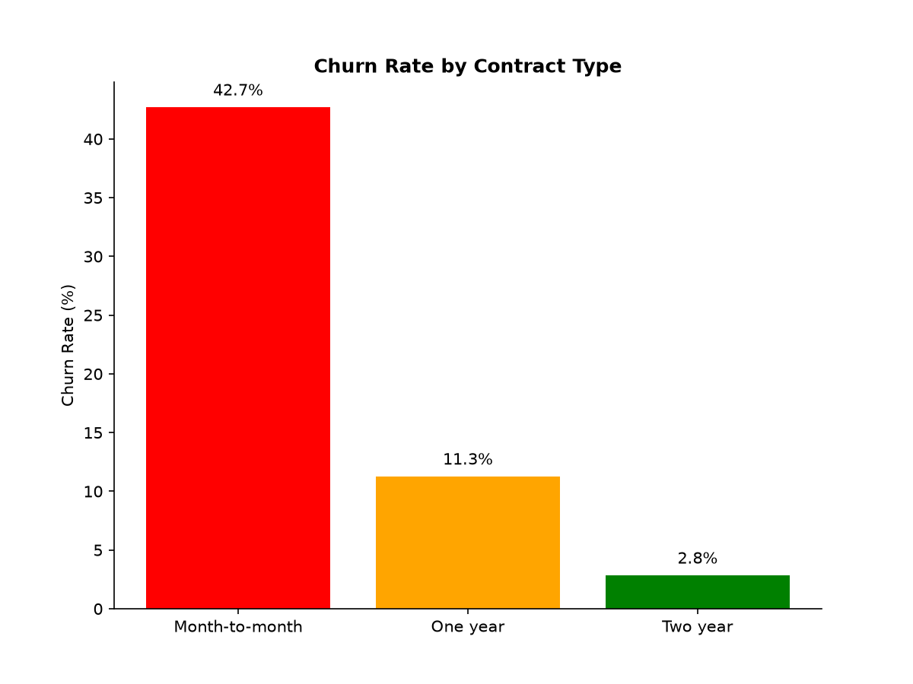
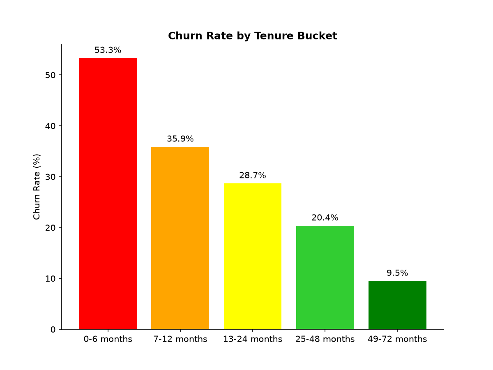
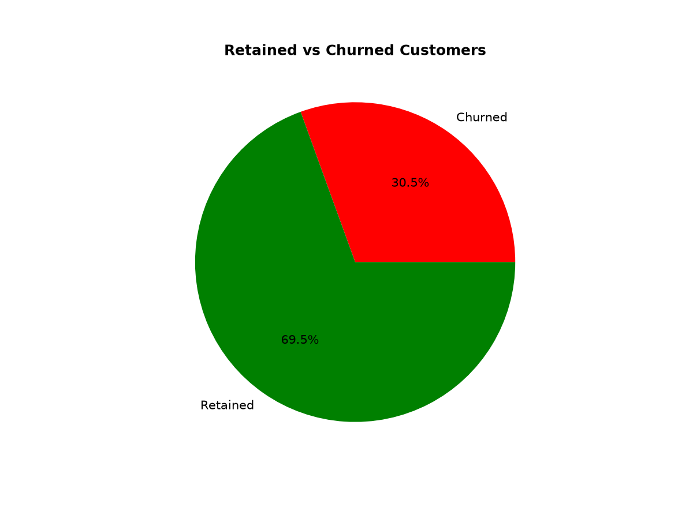

# Customer Retention Analysis

## Preview

  <table>
    <tr>
      <td></td>
      <td></td>
      <td></td>
    </tr>
  </table>

## 1. Business Problem

A telecom provider is losing a meaningful share of its customer base every month, and leadership wants to know: **which customers are churning, why they’re leaving, and where to focus limited retention efforts.**

This isn't a modeling exercise — it's a resource-allocation problem. The company can't stop all churn, so the real question is: what's the highest-impact place to intervene?

## 2. Data

Public dataset: [IBM Telco Customer Churn sample](https://www.kaggle.com/datasets/blastchar/telco-customer-churn), 7,043 customer records covering demographics, account details, services, and churn status.

## 3. Approach

Python (pandas) for cleaning and analysis, SQL Server for a second, independently verified pass 
using the same dataset — every result below matches exactly across both tools. See `analysis_python.ipynb` 
and `analysis_sqlserver.sql`.

## 4. Key Findings

- **Overall exposure:** 26.6% of customers have churned, representing 30.5% of monthly revenue 
  ($139,131 of $455,661/month) — churned customers are disproportionately higher-value.
- **Contract type is the strongest driver:** Month-to-month churns at 42.7%, vs. 11.3% (one year) 
  and 2.8% (two year).
- **Risk is front-loaded:** 53.3% churn in the first 6 months, dropping to 9.5% after year 4.
- **Highest-risk segment:** month-to-month + electronic check + tenure ≤12mo — 954 customers, 
  63.1% churn, $66,072/month exposed.
- **High-value losses aren't concentrated where you'd expect:** the highest-paying churned 
  customers are spread across all three contract types, not just month-to-month — the biggest 
  *risk* segment and the biggest *value* losses aren't quite the same population.

## 5. Recommendation

Target the compounding-risk segment directly (month-to-month, electronic check, tenure ≤12mo) with 
a discounted contract-conversion offer, rather than a broad company-wide campaign. Before scaling 
spend, A/B test it — the payment-method correlation may reflect a price-sensitive customer type, 
not a fixable friction point.

## 6. Limitations

Single point-in-time snapshot — shows correlation, not proof of causation. Recommendations should 
be validated with a controlled test before full rollout.
